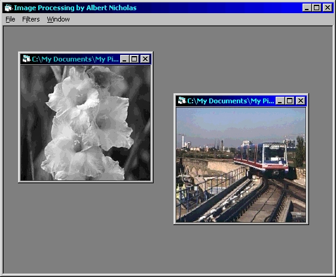



## Image Processing v2\.1

### Description

An updated version of earlier image processing. By using Windows API functions, this project will process images much quicker than the earlier version (this is the fastest way VB can do, I guess). Sample project of image processor application and using MDI form for easy use opening more than one picture. Give it rate and comments, friends :)

Included : sample01.jpg & sample02.jpg -just for sample pictures-

----

Changes in v2.1

----

- Changed Lighten/Darken to Adjust Brightness

- Added progress bar and save option (due to demands)

- Added new adjustment : Color Balance

- Added new filters : Diffuse, Emboss, Lighting Effects, Sharpen, and Solarize

n.b: I found Lighting Effects by mistakes, and I think it's not the original method. If you know about the algorithm, please let me know, OK :)
 
### More Info
 
Have MSCOMCTL.OCX already installed in your machine (in windows\system directory), for the progress bar and slider control.

             |
---                |---
**Submitted On**   |2000-05-19 23:37:00
**By**             |[Albert Tedja](https://github.com/Planet-Source-Code/PSCIndex/blob/master/ByAuthor/albert-tedja.md)
**Level**          |Advanced
**User Rating**    |4.5 (18 globes from 4 users)
**Compatibility**  |VB 5\.0, VB 6\.0
**Category**       |[Complete Applications](https://github.com/Planet-Source-Code/PSCIndex/blob/master/ByCategory/complete-applications__1-27.md)
**World**          |[Visual Basic](https://github.com/Planet-Source-Code/PSCIndex/blob/master/ByWorld/visual-basic.md)
**Archive File**   |[CODE\_UPLOAD59075192000\.zip](https://github.com/Planet-Source-Code/albert-tedja-image-processing-v2-1__1-8196/archive/master.zip)

